# 智慧民宿

## 整体的框架设计

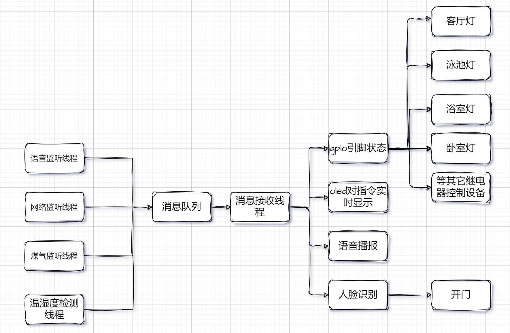

## 实物图


整个项目开启4个监听的线程，分别是：

> 1. 语音监听线程：用于监听指令，当有语音指令过来，通过消息队列的方式给消息队列处理线程发送指令
> 2. 网络监听线程：用于监听网络指令，当有网络指令过来，通过消息队列的方式给消息处理线程发送指令
> 3. 温湿度监听：检测温湿度，发送数据到消息对流，处理并将数据显示到`oled`屏上
> 4. 火灾检测线程：当存在煤气泄漏或者火灾险情时，发送警报指令给消息处理线程
> 5. ==消息监听线程==：用于处理以上4个线程发过来的指令，并根据指令要求配置`GPIO`引脚的状态，`OLED`屏显示、语音播报，还有人脸识别开门（这里使用舵机来模拟开门）。

上述四个线程采用统一一个对外接口，同时==添加到监听链表==中。

**统一的==监听模块==接口如下：**

```c
typedef struct input_dev
{
    char input_dev_name[32];
    int (*init)(void);
    void (*final)(void);
    void *(*recvRoutine)(void *arg);
    void *(*sendRoutine)(void *arg);

    struct input_dev *next;
} input_dev_t;

input_dev_t *add_input_dev(input_dev_t *phead, input_dev_t *pdev);

```

**另外，被==控制的设备类==也统一配置接口，同时添加到设备链表中。**

```c
typedef struct output_dev
{
    char output_dev_name[32];
    int key;        //! 用来查找
    int gpio_pin;   //! gpio引脚号
    int gpio_mode;  //! gpio模式output 或则 input
    int gpio_value; //! gpio状态  LOw:低电平 HIGH:高电平
    int check_face_status;
    int voice_set_status;
    struct output_dev *next;
} output_dev_t;
//! 添加设备节点

output_dev_t *add_output_dev(output_dev_t *phead, output_dev_t *pnew);
output_dev_t *find_output_dev(output_dev_t *phead, int key);
int set_gpio_value(output_dev_t *pdev);
int set_all_low(output_dev_t *phead);
int set_all_hight(output_dev_t *phead);
```

### 软件设计模式（有23种，面向对象的编程）

为了解决代码的==复用性==和可==维护性==，这次项目采用软件设计模式中的工厂方法模式。

工厂方法模式，提供一个抽象类，该抽象类中具有创建产品的方法。继承到子类，并在其子类中具体实现产品的创建。

通过一种类型的指针，我们可以动态的改变指针（传参）的指向，从而实现多态。


### C语言实现简单工厂方法

由于这个C语言不具备C++类的概念，不能方便地使用软件设计模式，但是我们可以通过多种方式模拟。

如：通过各种数据结构，如顺序表、链表、联合体等，还可以通过void* 型指针来实现多态。

但是它们都是具有各种缺点的。

这里采用链表来实现

通过链表来作为这个抽象类型的指针，提供创建节点的方法（通过传参来实现不同设备的创建）。

具体的实现在各自对应的链表的节点中。


## 遇到的问题

### 1、软件与硬件之间的同步问题

解决：	

​	由于软件的执行速度是非常快的，各个设备在接收信号的时候需要一定的延时时间，对此解决的方案是在软件发送一段数据后设置一定的延时时间。


### 2、温湿度检测数据，由于没有加滤波，数据有的时候不是很稳定，会导致读取失败

解决：

​	读取失败后，再次初始化温湿度传感器，再次读取数据。

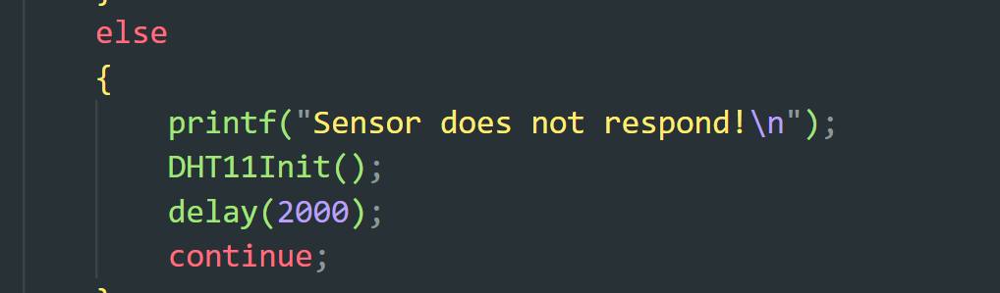

### 3、温湿度模块检测的数据发送到消息队列中后，通过字符串处理，将实时检测的数据显示在`oled`上，但是使用控制灯模块时，出==现段错误==。

解决：

​	在`CMakeLists`中加入`CFLAGS `-`g` `-fsanitize=address`选项，把可执行文件传输到开发板，使用`gdb ./my_program core`命令==打开核心转储文件==调试程序，run运行程序，出现段错误

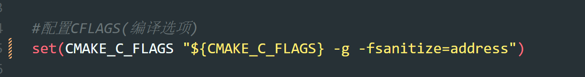

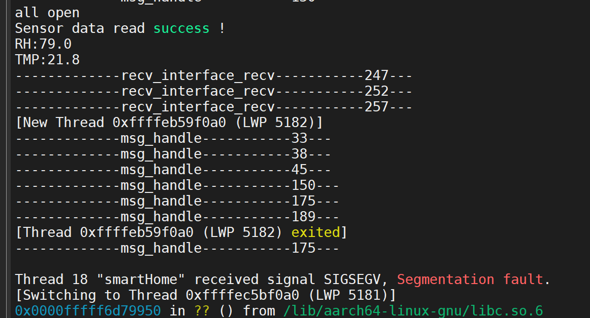

在`GDB`中运行 `bt` （backtrack回溯）命令查看堆栈回溯信息，以便确定程序崩溃的位置

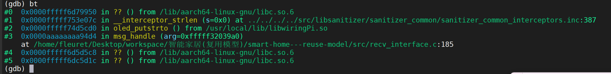

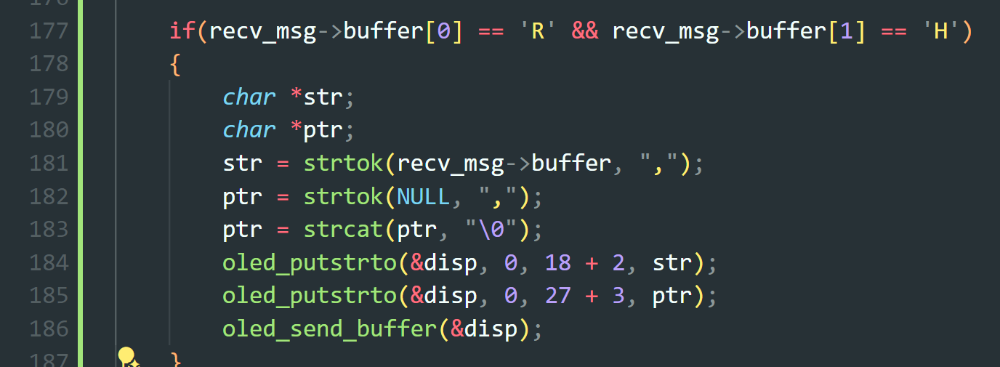

定位185行。

再次运行程序，发现`ptr`在某个时刻为`NULL`

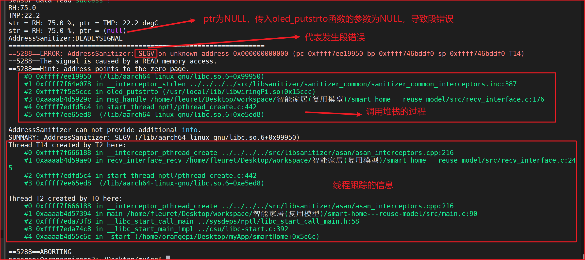

解决：

使用`str`类函数，会导致传入NULL，引起段错误。把`oled`显示改为一行

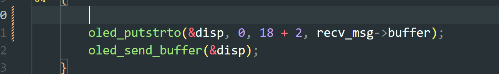

## 引入`ini`文件

​		为了解决这个`output`设备添加时，需要再次添加源文件和头文件以及修改`recv`线程中的代码，违背了开放闭合原则，==不利于代码的维护==，使得文件繁多，引入`Linux`系统中的`init`文件（.`service`后缀）。

1、查看使用的库名

```bash
apt-cache search libinih
```

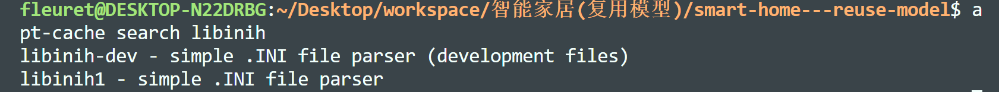

`libinih-dev`就是我们要的库

注意，不同平台的库文件是编译器是不兼容的

2、下载库

```bash
sudo apt install libinih-dev
```

下载这个库

3、下载源码

```bash
apt source libinih-dev
```

下载不了可以去`github`上下载

```bash
git clone https://github.com/benhoyt/inih.git
```

下好了如果`Cmake`链接的时候不知道这个库的路劲可以使用下面方法来寻找

- **头文件路径：**

  ```
  bashCopy code
  dpkg-query -L libinih-dev | grep include
  ```

  这会列出包含头文件的目录，通常是 `/usr/include` 或类似路径。

- **库文件路径：**

  ```
  bashCopy code
  dpkg-query -L libinih-dev | grep lib
  ```

  这会列出包含库文件的目录，通常是 `/usr/lib` 或类似路径。

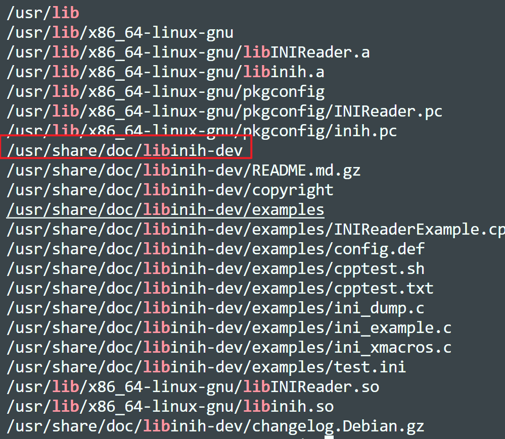

4、编写测试代码

我们只需要使用`ini.c` 和`ini.h `这两个文件，自己再编写一个`.ini`文件，

仿照`github`的`examples`进行测试

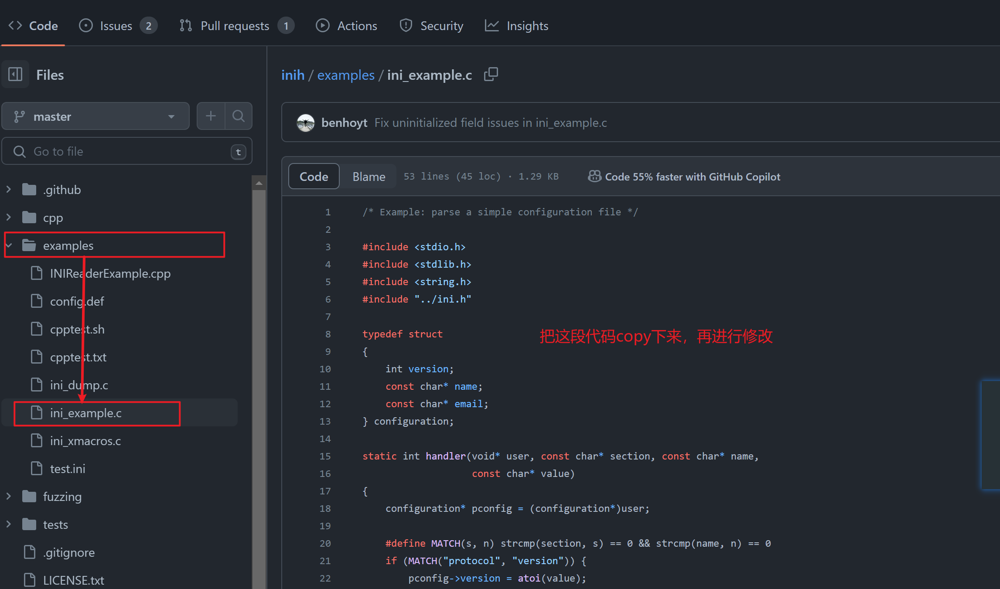

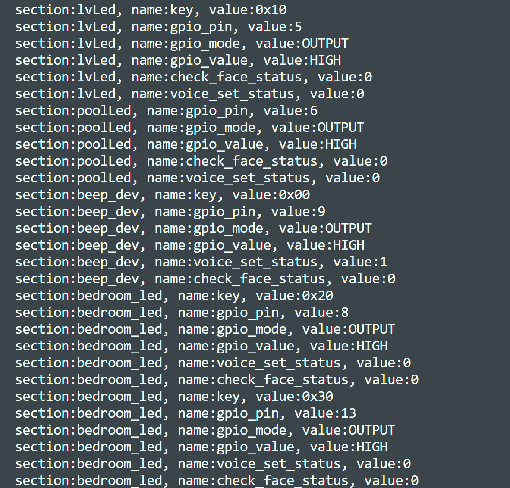

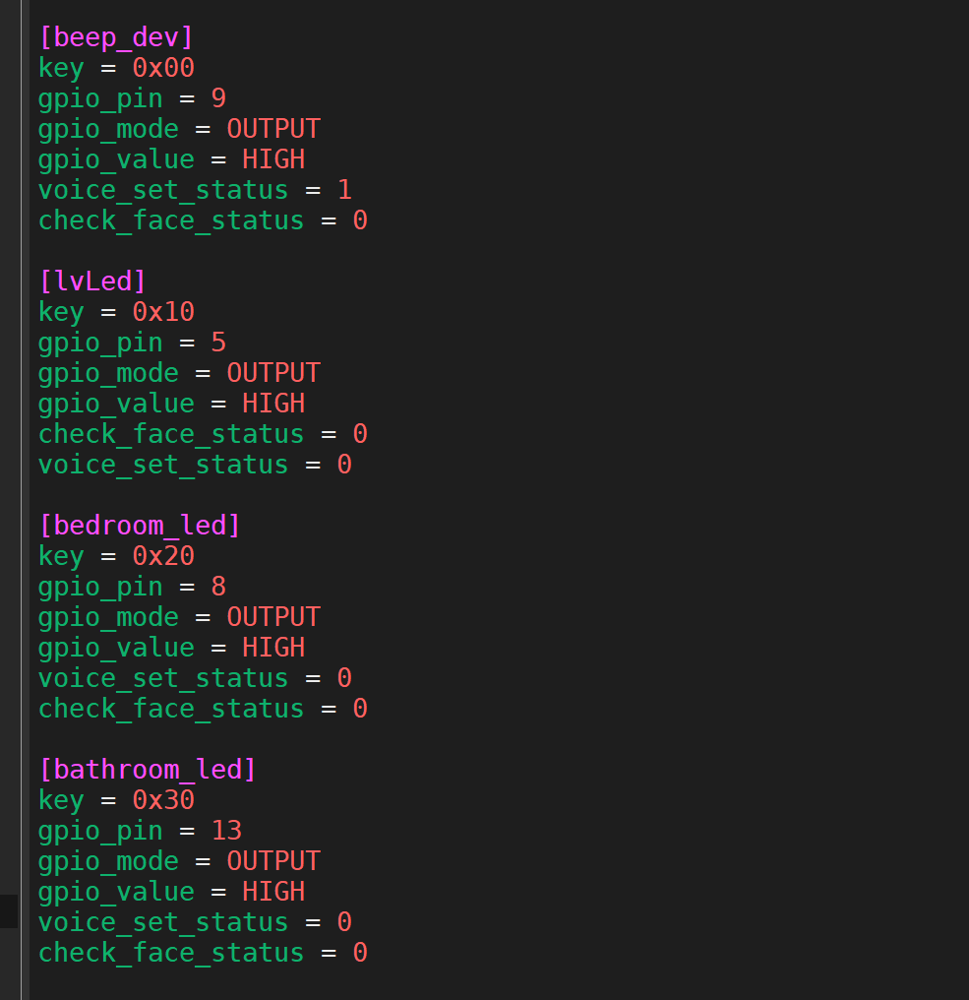


5、修改好代码

```c
static output_dev_t *ohead = NULL;

#define MATCH(s, n) strcmp(section, s) == 0 && strcmp(name, n) == 0

static int handler(void *user, const char *section, const char *name,
                   const char *value) //! 回调函数，处理响应事件
{
    struct output_dev *tempDev = NULL;
    if (NULL == ohead)
    {
        ohead = (output_dev_t *)malloc(sizeof(output_dev_t));
        memset(ohead, 0, sizeof(output_dev_t));
        strcpy(ohead->output_dev_name, section); //! section 为设备名
    }
    else if (strcmp(ohead->output_dev_name, section))
    {
        tempDev = (output_dev_t *)malloc(sizeof(output_dev_t));
        memset(tempDev, 0, sizeof(output_dev_t));
        strcpy(tempDev->output_dev_name, section); //! section 为设备名
        tempDev->next = ohead;
        ohead = tempDev; //! 不带头节点的头插法
    }

    if (NULL != ohead)
    {
        if (MATCH(ohead->output_dev_name, "key"))
        {
            sscanf(value, "%x", &ohead->key);
            printf("|%d|key = %x\n", __LINE__, ohead->key);
        }
        else if (MATCH(ohead->output_dev_name, "gpio_pin"))
        {
            ohead->gpio_pin = atoi(value);
        }
        else if (MATCH(ohead->output_dev_name, "gpio_mode"))
        {
            if (!strcmp(value, "OUTPUT")) //! C语言中字符串不能直接比较，需要使用strcmp函数
                ohead->gpio_mode = OUTPUT;
            if (!strcmp(value, "INPUT"))
                ohead->gpio_mode = INPUT;
        }
        else if (MATCH(ohead->output_dev_name, "gpio_value"))
        {
            if (!strcmp(value, "HIGH"))
                ohead->gpio_value = HIGH;
            if (!strcmp(value, "LOW"))
                ohead->gpio_value = LOW;
        }
        else if (MATCH(ohead->output_dev_name, "check_face_status"))
        {
            ohead->check_face_status = atoi(value);
        }
        else if (MATCH(ohead->output_dev_name, "voice_set_status"))
        {
            ohead->voice_set_status = atoi(value);
        }
    }
}

static int recv_interface_init(void)
{

    if (ini_parse("output_dev.ini", handler, NULL) < 0)
    {
        printf("Can't load 'output_dev.ini'\n");
        return -1;
    }

    myOledInit();
    face_init();
    return 0;
}
```

6、注意拷贝的时候要把`.ini`文件也考到开发板上面去.


## 添加程序开机自启

1、编写一个启动程序的`shell`脚本`startup.sh`

2、创建一个`.service`文件

```bash
sudo vim /etc/systemd/system/myservice.service
```

3、文件中添加，并保存

```bash
[Unit]
Description=My Service
After=network.target

[Service]
ExecStart=~/Desktop/myApp/startup.sh
User=orangepi
EnvironmentFile=/etc/environment
Restart=always

[Install]
WantedBy=default.target

```

4、启用和启动服务

```bash
sudo systemctl enable myservice.service
sudo systemctl start myservice.service
```

出现问题

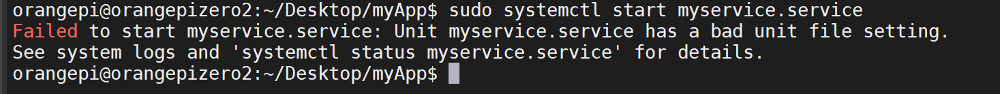

使用

```bash
sudo systemctl status myservice.service
```

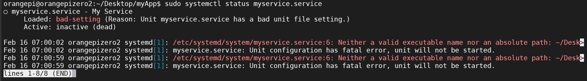

编写的可执行文件有问题

脚本文件中使用==绝对路径==，不要使用如：~/ 这样的相对路径。

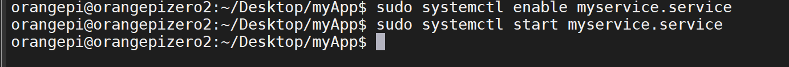

成功解决
